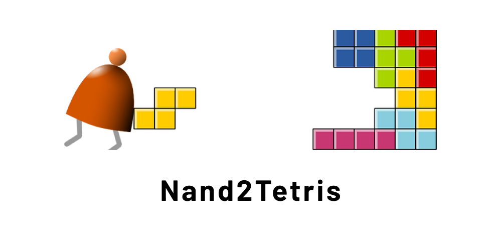

# Nand2Tetris Implementation of Assembler, VM Translator and Jack Compiler

I have always been curious on how compilers work. Due to my curiosity, I decided to implement the assembler, VM Translator and Jack Compiler, which are all beyond the scope of my university course.

All software implemented are unit tested using JUnit.

## Translation Components

| Software      | Source Language                   | Target Language                |
| ------------- | --------------------------------- | ------------------------------ |
| Assembler     | Assembly (.asm)                   | Hack Machine Language (.hack)  |
| VM Translator | Virtual Machine Language (.vm)    | Assembly (.asm)                |
| Jack Compiler | Jack Programming Language (.jack) | Virtual Machine Language (.vm) |

## Installation Steps

1. Compile using `javac` or a assisted build tool such as IntelliJ IDEA.
2. Run the respective file using a command such as `java Assembler loop.asm`
